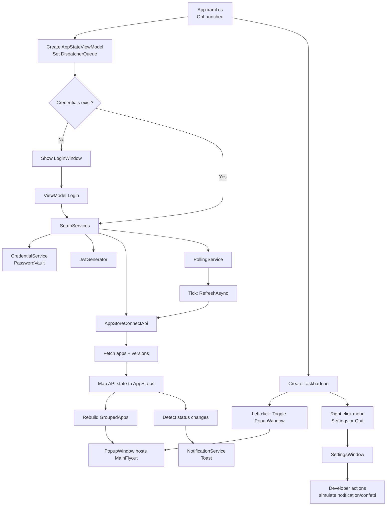

# AppNotify Windows Code Map

This document maps the key files and runtime flows in the AppNotify Windows codebase.

## At a glance

- Project type: unpackaged WinUI 3 tray app (`net10.0-windows10.0.19041.0`)
- Primary executable project: `AppNotify/AppNotify.csproj`
- No main shell window: the app is driven by a tray icon, popup flyout window, and settings/login windows.

## Architecture diagram



## Runtime flow

1. App startup happens in `AppNotify/App.xaml.cs` (`App.OnLaunched`).
2. A shared `AppStateViewModel` is created and initialized with the UI dispatcher.
3. Authentication is checked via `CredentialService`.
4. If authenticated, services are wired (`JwtGenerator`, `AppStoreConnectApi`, `PollingService`) and polling starts.
5. Tray icon (`H.NotifyIcon`) is created with:

- Left click: toggle popup (`PopupWindow` hosting `MainFlyout`)
- Right click: context menu (Settings, Quit)

1. `PollingService` periodically triggers `AppStateViewModel.RefreshAsync()`.
2. Refresh pulls App Store Connect data, updates grouped app state, and emits toast notifications for status changes.
3. If not authenticated on launch, `LoginWindow` is shown first.

## Key folders

- `AppNotify/Services`: external integrations and background behavior (API, auth, polling, notifications)
- `AppNotify/ViewModels`: app-level state and orchestration logic (`AppStateViewModel`)
- `AppNotify/Views`: WinUI windows and user controls (`PopupWindow`, `MainFlyout`, `SettingsWindow`, `LoginWindow`)
- `AppNotify/Models`: API DTOs, domain models, and status enum/metadata
- `AppNotify/Helpers`: value converters and confetti animation helper

## Core files

### Application entry and window lifetime

- `AppNotify/App.xaml.cs`
- Creates/stores long-lived window and tray icon references to avoid GC/lifetime issues.
- Owns top-level actions: toggle popup, open settings, open login, quit app.
- Captures `DispatcherQueue` and injects it into `AppStateViewModel`.

- `AppNotify/App.xaml`
- Global WinUI resources (`XamlControlsResources`).

### View model and app state

- `AppNotify/ViewModels/AppStateViewModel.cs`
- Single shared app state instance used across windows.
- Handles auth lifecycle (`CheckAuthentication`, `Login`, `Logout`).
- Starts/stops polling and controls polling interval updates.
- Refresh flow:
- Calls `AppStoreConnectApi.FetchAllAppsAsync()`
- Compares old/new statuses
- Sends notifications on status transitions
- Rebuilds grouped status collections for the UI
- Persists hidden apps to `hidden-apps.json` at app base directory.

### Services

- `AppNotify/Services/CredentialService.cs`
- Stores/retrieves App Store Connect credentials using `PasswordVault`.

- `AppNotify/Services/JwtGenerator.cs`
- Generates ES256 JWT for App Store Connect; caches token until near expiry.

- `AppNotify/Services/AppStoreConnectApi.cs`
- Calls App Store Connect REST API:
- Fetches apps
- Fetches app store versions per app
- Picks latest by `createdDate`
- Maps `appVersionState` to local `AppStatus`

- `AppNotify/Services/PollingService.cs`
- Background periodic timer wrapper.
- Runs action immediately, then on interval.

- `AppNotify/Services/NotificationService.cs`
- Builds and shows toast notifications.
- Adds celebration text for `PendingDeveloperRelease`.

### Models

- `AppNotify/Models/AppStatus.cs`
- Canonical status enum and metadata extensions:
- `FromApiString`
- `DisplayName`
- `SortOrder`
- `StatusColor`

- `AppNotify/Models/AppInfo.cs`
- Core app/version domain model used by ViewModel and UI.

- `AppNotify/Models/ApiResponses.cs`
- JSON DTOs for App Store Connect responses.

### UI (windows and flyout)

- `AppNotify/Views/PopupWindow.xaml`
- Minimal shell window hosting `MainFlyout`.

- `AppNotify/Views/PopupWindow.xaml.cs`
- Popup behavior:
- compact non-resizable window
- positions near system tray (bottom-right)
- hides when deactivated (instead of closing)

- `AppNotify/Views/MainFlyout.xaml`
- Main UI content for grouped app status list, refresh control, hide app, settings/quit actions.
- Uses converters from `Helpers/Converters.cs`.
- Uses `{Binding}` data templates (important for current WinUI/.NET 10 preview toolchain stability).

- `AppNotify/Views/MainFlyout.xaml.cs`
- UI event handlers delegating to `AppStateViewModel`.

- `AppNotify/Views/LoginWindow.xaml`
- First-run credential capture form (Issuer ID, Key ID, `.p8` private key).

- `AppNotify/Views/LoginWindow.xaml.cs`
- Handles file picking for key and calls `ViewModel.Login(...)`.

- `AppNotify/Views/SettingsWindow.xaml`
- Top navigation sections: General, Account, Developer.
- Developer page includes simulation/test actions.

- `AppNotify/Views/SettingsWindow.xaml.cs`
- Polling and sound settings wiring.
- Account sign out handling.
- Developer utilities (simulate notifications, trigger confetti, unhide apps).
- Uses `MessageBeep` P/Invoke for system sounds.

### Visual effects helpers

- `AppNotify/Views/ConfettiWindow.xaml`
- Transparent overlay canvas for celebration effect.

- `AppNotify/Views/ConfettiWindow.xaml.cs`
- Fullscreen click-through topmost overlay window lifecycle.

- `AppNotify/Helpers/ConfettiHelper.cs`
- Confetti particle simulation loop using `DispatcherTimer`.

- `AppNotify/Helpers/Converters.cs`
- UI converters for status colors, display names, relative time, and visibility toggles.

## Important implementation notes

- Tray icon is created in code (`App.xaml.cs`) with `H.NotifyIcon`; this app does not rely on a main WinUI shell window.
- `AppStateViewModel` updates from polling are marshaled onto the UI thread via captured `DispatcherQueue`.
- Polling interval is configurable at runtime and restarts the timer.
- Hidden apps are user-local state persisted to `hidden-apps.json`.
- Status grouping/sorting is driven centrally by `AppStatus` extension methods.

## Where to make common changes

- Add/adjust status labels, order, or colors: `AppNotify/Models/AppStatus.cs`
- Change polling behavior: `AppNotify/Services/PollingService.cs` and `AppNotify/ViewModels/AppStateViewModel.cs`
- Modify App Store Connect API requests: `AppNotify/Services/AppStoreConnectApi.cs`
- Update login/auth storage behavior: `AppNotify/Views/LoginWindow.xaml.cs`, `AppNotify/Services/CredentialService.cs`
- Adjust main popup UI layout: `AppNotify/Views/MainFlyout.xaml`
- Add settings options/actions: `AppNotify/Views/SettingsWindow.xaml` and `AppNotify/Views/SettingsWindow.xaml.cs`
- Tune notification content: `AppNotify/Services/NotificationService.cs`

## Build

From repo root:

```powershell
cd AppNotify
dotnet build
```

No dedicated test project is currently present.
